# Peer-to-Playlist: Comprehensive System Architecture

## Table of Contents

Here's the updated table of contents that includes your new sections:

## Table of Contents

- [Introduction](#introduction)
- [Live Deployment](#live-deployment)
- [Screenshots](#screenshots)
- [Installation and Setup](#installation-and-setup)
  - [Server Side (Backend)](#server-side-backend)
  - [Client Side (Frontend)](#client-side-frontend)
  - [Environment Variables](#environment-variables)
- [Directory Structure](#directory-structure)
- [System Overview](#system-overview)
- [Core Technologies](#core-technologies)
- [Authentication Workflows](#authentication-workflows)
  - [Login Flow](#login-flow)
  - [Signup Flow](#signup-flow)
  - [Session Management](#session-management)
  - [Spotify Authentication Flow](#spotify-authentication-flow)
- [Matching System Workflows](#matching-system-workflows)
  - [Profile Scoring Algorithm](#profile-scoring-algorithm)
  - [User Discovery Flow](#user-discovery-flow)
  - [Swiping Mechanics](#swiping-mechanics)
  - [Real-time Match Notification](#real-time-match-notification)
- [Messaging System Workflows](#messaging-system-workflows)
  - [Message Delivery Flow](#message-delivery-flow)
  - [Attachments Processing](#attachments-processing)
  - [Link Previews](#link-previews)
  - [Common Tracks Integration](#common-tracks-integration)
- [File Storage Architecture](#file-storage-architecture)
  - [S3 Presigned URLs](#s3-presigned-urls)
  - [Cloudinary Integration](#cloudinary-integration)
  - [File Viewing & Download System](#file-viewing--download-system)
- [Real-time Communication](#real-time-communication)
  - [Socket.IO Server Architecture](#socketio-server-architecture)
  - [Event Subscription Model](#event-subscription-model)
  - [Connection Management](#connection-management)
- [Data Models](#data-models)
- [API Endpoints](#api-endpoints)
- [Security Considerations](#security-considerations)
- [Implementation Details](#implementation-details)
- [Future Enhancements](#future-enhancements)
- [Conclusion](#conclusion)
- [Contributors](#contributors)
- [License](#license)
- [References](#references)
  - [Core Technologies](#core-technologies-1)
  - [State Management & Data Fetching](#state-management--data-fetching)
  - [Authentication & Security](#authentication--security)
  - [UI Components & Styling](#ui-components--styling)
  - [File Handling & Media](#file-handling--media)
  - [Real-time Features](#real-time-features)
  - [Animation & Motion](#animation--motion)
  - [Development Tools](#development-tools)
  - [Utilities](#utilities)

## Introduction

### Shahir Ahmed and Megan Triplett

Peer-to-Playlist is a real-time social networking application that matches users based on their shared music preferences. The system leverages Spotify's API to analyze users' music tastes and create meaningful connections, combined with a robust messaging system that incorporates multimedia sharing and real-time notifications.

This document provides a comprehensive overview of the architecture and workflows that power the application, from authentication and matching algorithms to real-time messaging and file handling.

## Live Deployment

🔗 [Peer-to-Playlist](https://peer-to-playlist.onrender.com)

## Screenshots


---

## Installation and Setup

### Server Side (Backend)

In the project root directory (`./Peer-to-Playlist`):

```bash
npm install
npm run dev
```

### Client Side (Frontend)

Navigate to the client directory (`./Peer-to-Playlist/client`):

```bash
npm install
npm run dev
```

### Environment Variables

Create a `.env` file at the project root (`./Peer-to-Playlist`):

```env
PORT=5000
MONGO_URI=<mongodb_connection_url>
JWT_SECRET=<secure_jwt_secret>
NODE_ENV=development
CLIENT_URL=http://localhost:5173

CLOUDINARY_API_KEY=<cloudinary_api_key>
CLOUDINARY_API_SECRET=<cloudinary_api_secret>
CLOUDINARY_CLOUD_NAME=<cloudinary_cloud_name>

AWS_REGION=<aws_region>
AWS_ACCESS_KEY_ID=<aws_access_key_id>
AWS_SECRET_ACCESS_KEY=<aws_secret_access_key>
AWS_S3_BUCKET=<s3_bucket_name>

SPOTIFY_CLIENT_ID=<spotify_client_id>
SPOTIFY_CLIENT_SECRET=<spotify_client_secret>
SPOTIFY_REDIRECT_URI=http://localhost:5000/api/auth/spotify/callback
```

### Directory Structure

```plaintext
Directory structure:
└── peer-to-playlist/
    ├── README.md
    ├── LICENSE
    ├── package.json
    ├── api/
    │   ├── server.js
    │   ├── config/
    │   │   ├── cloudinary.js
    │   │   ├── db.js
    │   │   ├── s3.js
    │   │   └── spotify.js
    │   ├── controllers/
    │   │   ├── authController.js
    │   │   ├── matchController.js
    │   │   ├── messageController.js
    │   │   ├── spotifyController.js
    │   │   └── userController.js
    │   ├── middleware/
    │   │   └── auth.js
    │   ├── models/
    │   │   ├── Attachment.js
    │   │   ├── Message.js
    │   │   └── User.js
    │   ├── routes/
    │   │   ├── authRoutes.js
    │   │   ├── linkPreview.js
    │   │   ├── matchRoutes.js
    │   │   ├── messageRoutes.js
    │   │   ├── spotifyRoutes.js
    │   │   ├── upload.js
    │   │   └── userRoutes.js
    │   ├── seeds/
    │   │   └── user.js
    │   ├── socket/
    │   │   └── socket.server.js
    │   └── utils/
    │       └── spotifyClientFactory.js
    └── client/
        ├── README.md
        ├── eslint.config.js
        ├── index.html
        ├── package-lock.json
        ├── package.json
        ├── vite.config.js
        ├── .gitignore
        ├── public/
        │   ├── female/
        │   └── male/
        └── src/
            ├── App.jsx
            ├── index.css
            ├── main.jsx
            ├── components/
            │   ├── Header.jsx
            │   ├── LinkPreviewCard.jsx
            │   ├── LoginForm.jsx
            │   ├── MessageInput.jsx
            │   ├── PreviewAttachment.jsx
            │   ├── SharedChipsWithModal.jsx
            │   ├── Sidebar.jsx
            │   ├── SignUpForm.jsx
            │   ├── SwipeArea.jsx
            │   ├── SwipeFeedback.jsx
            │   └── ViewAttachmentModal.jsx
            ├── lib/
            │   └── axios.js
            ├── pages/
            │   ├── AuthPage.jsx
            │   ├── ChatPage.jsx
            │   ├── HomePage.jsx
            │   └── ProfilePage.jsx
            ├── socket/
            │   └── socket.client.js
            └── store/
                ├── useAuthStore.js
                ├── useMatchStore.js
                ├── useMessageStore.js
                └── useUserStore.js
```

## System Overview

Peer-to-Playlist's architecture is divided into distinct layers with clear separation of concerns:


## Core Technologies

The application is built using the following core technologies:

**Frontend:**

- React.js for UI components
- Zustand for state management
- Socket.IO Client for real-time communication
- Axios for HTTP requests
- TailwindCSS for styling

**Backend:**

- Node.js with Express for the API server
- JWT for authentication
- Socket.IO for real-time communication
- Mongoose for MongoDB object modeling
- AWS SDK for S3 integration
- Cloudinary SDK for media handling
- Spotify Web API Node for Spotify integration

**Databases & Storage:**

- MongoDB for user data, matches, and messages
- AWS S3 for document storage
- Cloudinary for media storage and optimization

## Authentication Workflows

### Login Flow


The login flow authenticates users and establishes a secure session:

1. User submits login credentials through the frontend
2. Backend verifies credentials against the MongoDB database
3. If valid, the server:
   - Generates a JWT token with a 7-day expiration
   - Sets the token as an HTTP-only cookie (preventing client-side JavaScript access)
   - Returns user data (excluding password)
4. Frontend:
   - Initializes a Socket.IO connection with the user's ID for real-time features
   - Updates global state with user information
   - Redirects to the main application interface

### Signup Flow


The signup flow registers new users and optionally connects their Spotify account:

1. User completes the signup form with required fields (name, email, password, age) and can choose to connect their Spotify account
2. If connecting Spotify:
   - Backend generates a Spotify authorization URL with required scopes
   - Frontend opens a popup for the user to authenticate with Spotify
   - Spotify redirects back with an authorization code
   - Backend exchanges the code for access and refresh tokens
   - Frontend receives tokens via postMessage
3. Frontend sends user data and Spotify tokens to the backend
4. If a profile image is provided, it's uploaded to Cloudinary
5. If Spotify is connected, the server:
   - Creates a Spotify client with the tokens
   - Fetches user's profile, top artists, top tracks, saved tracks, and followed artists
   - Stores this data in the user object
6. Backend creates a new user in MongoDB
7. Server emits a "newUserProfile" event to all connected clients
8. Backend generates a JWT token and sets it as an HTTP-only cookie
9. Frontend initializes Socket.IO and updates global state

### Session Management


Session management ensures that only authenticated users can access protected resources:

1. When the frontend makes requests to protected routes, the JWT cookie is automatically included
2. The `protectedRoute` middleware:
   - Extracts the JWT token from cookies
   - Verifies the token using the JWT_SECRET
   - Retrieves the user's ID from the decoded token
   - Fetches the user from MongoDB
   - Attaches the user object to the request for downstream handlers
3. If the token is invalid or expired, the server responds with a 401 Unauthorized status
4. The frontend redirects to the login page on authentication failures

On application load, the frontend checks the current authentication status by making a request to `/api/auth/me` which is protected by the same middleware.

### Spotify Authentication Flow


The Spotify authentication flow securely connects users' Spotify accounts:

1. User initiates the process by clicking "Connect Spotify"
2. Backend:
   - Generates a random state parameter to prevent CSRF attacks
   - Creates a Spotify authorization URL with required scopes
   - Returns the URL to the frontend
3. Frontend opens a popup with the authorization URL
4. User authenticates with Spotify and grants permissions
5. Spotify redirects to the callback endpoint with an authorization code and state parameter
6. Backend:
   - Verifies the state parameter matches a pending request
   - Exchanges the code for access and refresh tokens
   - Returns tokens to the frontend via postMessage
7. Frontend closes the popup and either:
   - Includes the tokens in the signup form data, or
   - Sends the tokens to update an existing user's profile
8. Backend fetches the user's Spotify data and stores it in the database

The required Spotify scopes include:

- user-read-private
- user-read-email
- user-top-read
- user-library-read
- user-follow-read

## Matching System Workflows

### Profile Scoring Algorithm


The matching algorithm calculates compatibility scores between users based on their Spotify data:

1. For each potential match, the system compares:
   - Common top artists (weight: 3)
   - Common top tracks (weight: 2)
   - Common saved tracks (weight: 1)
   - Common followed artists (weight: 1)
2. Score calculation: `score = (commonArtists.length * 3) + (commonTracks.length * 2) + (commonSaved.length * 1) + (commonFollowed.length * 1)`
3. Users are then sorted by score in descending order
4. Each matching element (artist, track) is enhanced with human-readable names fetched from Spotify

The scoring mechanism prioritizes taste in artists above individual tracks, creating more meaningful connections based on broader musical preferences.

### User Discovery Flow


The user discovery flow presents potential matches to users:

1. Frontend requests potential profiles from the backend
2. Backend:
   - Retrieves the current user's data
   - Creates an exclusion list containing: the current user, users already liked/disliked, and existing matches
   - Queries the database for all users not in the exclusion list
   - Creates a Spotify client using the current user's tokens
3. For each potential match, the system:
   - Calculates overlap between profiles (common artists, tracks, etc.)
   - Computes a match score using the weighted algorithm
   - Tracks artist and track IDs for batch name lookups
4. Backend performs batch queries to Spotify to retrieve human-readable names
5. Results are sorted by compatibility score and returned to the frontend
6. Frontend displays potential matches, highlighting common musical interests

This approach minimizes API calls by batching Spotify requests and using an in-memory cache for artist and track names.

### Swiping Mechanics


The swiping mechanics allow users to express interest or disinterest in potential matches:

**Swipe Right (Like):**

1. User swipes right on a profile in the frontend
2. Frontend sends a request to `/api/matches/swipe-right/:likedUserId`
3. Backend:
   - Retrieves current user and liked user data
   - Adds the liked user's ID to the current user's `likes` array
   - Checks if the liked user has already liked the current user
   - If it's a mutual like (match):
     - Adds both users to each other's `matches` array
     - Retrieves the Socket.IO mapping of user IDs to socket IDs
     - Sends real-time "newMatch" events to both users if they're online
4. Frontend displays a "Liked" feedback animation

**Swipe Left (Dislike):**

1. User swipes left on a profile in the frontend
2. Frontend sends a request to `/api/matches/swipe-left/:dislikedUserId`
3. Backend:
   - Retrieves current user data
   - Adds the disliked user's ID to the current user's `dislikes` array
4. Frontend displays a "Passed" feedback animation

This implementation ensures that profiles that have been interacted with don't reappear in the discovery feed.

### Real-time Match Notification


The real-time match notification system alerts users immediately when a match occurs:

1. When a user swipes right and it results in a match, the backend:
   - Retrieves the connected users map from Socket.IO
   - Looks up socket IDs for both users
2. For each online user, the server:
   - Emits a "newMatch" event containing the other user's profile data
   - This includes their ID, name, and profile image
3. On the frontend, when a "newMatch" event is received:
   - A toast notification appears informing the user of the new match
   - The matches list is updated to include the new match
   - The match score and shared music are calculated and displayed

The notification includes just enough information to identify the match without requiring an immediate API call, optimizing the real-time experience.

## Messaging System Workflows

### Message Delivery Flow


The message delivery system combines persistent storage with real-time delivery:

1. Sender types a message and clicks send
2. Frontend:
   - Optimistically adds the message to local state for immediate feedback
   - Sends the message to the backend with content, receiver ID, and any attachments
3. Backend:
   - Creates a new message document in MongoDB
   - Gets the Socket.IO connected users map
   - Checks if the receiver is currently online
   - If online, emits a "newMessage" event to the receiver's socket
4. Receiver's frontend (if online):
   - Receives the message immediately via Socket.IO
   - Adds it to the current conversation state
   - Displays it in the chat interface
5. If the receiver is offline, they'll receive all messages when they next load the conversation

This approach ensures messages are never lost while providing instant delivery when possible.

### Attachments Processing


The attachments processing system handles different file types appropriately:

1. User selects a file to attach to a message
2. Frontend determines the file type and categorizes it:
   - **Media files** (images, videos, audio):
     - Converted to base64 data URLs in the browser
     - Sent directly to the backend in the message request
     - Uploaded to Cloudinary by the backend for optimization and CDN delivery
   - **Documents** (PDFs, Office files, etc.):
     - Frontend requests a presigned S3 URL from the backend
     - Backend generates a secure, temporary URL with write permissions
     - Frontend uploads the file directly to S3 using the presigned URL
     - Only the metadata (URL, key, name, extension, category) is sent in the message request
3. The message controller saves all attachment metadata in the message document
4. Frontend displays appropriate previews based on the file type

This approach optimizes for:

- User experience (immediate feedback)
- Security (no direct cloud credentials in frontend)
- Network efficiency (direct-to-cloud uploads for large files)
- Media optimization (using Cloudinary's transformations for media files)

### Link Previews


The link preview system enhances messages containing URLs:

1. As a user types, the frontend extracts URLs from the message text
2. For each URL:
   - Frontend requests preview data from the backend
   - Backend uses the link-preview-js library to fetch metadata from the URL
   - Library extracts title, description, image URL, and other metadata
   - Preview data is returned to the frontend
3. Frontend displays a preview card for each link
4. When the message is sent, the URLs to be previewed are included in the payload
5. Backend stores these URLs in the message document
6. When a message with preview URLs is loaded, the frontend fetches the preview data again to display

This approach balances:

- User experience (showing previews before sending)
- Performance (avoiding storing large preview data in the database)
- Privacy (fetching links server-side to avoid leaking user data)

### Common Tracks Integration


The common tracks integration enhances the messaging experience with shared music:

1. When a user opens a chat with a match, the frontend:
   - Retrieves match data, including common tracks
   - Displays a Spotify embedded player in the chat header
   - Loads the first common track in the player
2. Backend processes:
   - When fetching matches, the system calculates common tracks between users
   - Track IDs are converted to human-readable names using the Spotify API
   - Batch requests minimize API calls and an in-memory cache improves performance
3. User experience:
   - Users can navigate through shared tracks with previous/next buttons
   - Embedded player allows immediate playback of shared music
   - Common tracks serve as conversation starters with suggested messages

This integration creates a unique shared musical experience within the chat, reinforcing the app's core value proposition.

## File Storage Architecture

### S3 Presigned URLs


The S3 presigned URL system allows secure direct uploads:

1. Frontend requests a presigned URL from the backend:
   - Request includes the filename and MIME type
   - Backend generates a unique object key including the user ID, timestamp, and filename
   - AWS S3 SDK creates a presigned URL with a short expiration (60 seconds)
   - URL and key are returned to the frontend
2. Frontend uploads the file directly to S3:
   - File is sent directly from the user's browser to S3
   - This bypasses the backend server, avoiding transfer bottlenecks
   - After successful upload, the frontend includes file metadata in the message
3. Security benefits:
   - No AWS credentials exposed to the frontend
   - Limited-time access to write a specific object
   - User-specific path prefixes prevent cross-user access

### Cloudinary Integration


Cloudinary handles media files with automatic optimization:

1. Two primary upload paths:
   - **Profile images**: During signup or profile updates
   - **Media attachments**: When sending messages with images, videos, or audio
2. In both cases:
   - Media is sent as base64-encoded data from the frontend
   - Backend uploads to Cloudinary using the SDK
   - Cloudinary automatically:
     - Optimizes images for size and quality
     - Transcodes videos to appropriate formats
     - Generates thumbnails if needed
     - Serves content via its global CDN
3. Backend stores only the resulting URLs and metadata, not the raw files

Cloudinary provides several advantages:

- Automatic media optimization and format conversions
- Built-in responsive images and thumbnails
- Reduced bandwidth and storage requirements
- Global CDN with low latency

### File Viewing & Download System


The file viewing and download system provides a seamless experience for different file types:

1. When a user clicks an attachment, the ViewAttachmentModal component opens with the file's metadata
2. For S3-stored documents:
   - Frontend requests a presigned download URL from the backend
   - Backend generates a temporary URL with read access (expiring in 60 seconds for most files, 15 minutes for Office files)
   - Frontend fetches the file using the presigned URL
3. For Cloudinary media, the URL is used directly
4. Based on the file type, different viewers are used:
   - **PDFs**: Embedded PDF viewer with navigation controls
   - **Office documents**: Microsoft Office Online Viewer iframe
   - **Images**: Responsive image viewer with zoom
   - **Video/Audio**: HTML5 media player
   - **ZIP archives**: JSZip library extracts and displays the structure
   - **CSV files**: PapaParse library converts to a data table
5. Download functionality:
   - Creates a temporary download link
   - Sets the appropriate filename using the original name
   - Triggers the browser's download mechanism

This approach provides:

- Previews for most common file types without requiring downloads
- Secure, temporary access to files
- Appropriate viewers for different content types
- Easy download option for all file types

## Real-time Communication

### Socket.IO Server Architecture


The Socket.IO server architecture enables real-time communication:

1. Socket.IO server is attached to the same HTTP server as Express

   - This allows sharing the same port for both HTTP and WebSocket connections
   - Configuration matches the CORS settings of the Express app

2. Socket middleware:

   - Authenticates connections using the userId from the handshake
   - Attaches the userId to the socket instance for later reference
   - Rejects connections without valid user identification

3. Connected users map:

   - Maintains a mapping between user IDs and socket IDs
   - Updated when users connect and disconnect
   - Allows controllers to target specific users for real-time updates

4. Event types:
   - **newMessage**: Sent when a user receives a new message
   - **newMatch**: Sent when a mutual like creates a match
   - **newUserProfile**: Broadcast when a new user joins the platform
   - **disconnect**: Handled when a user disconnects

This architecture provides a foundational layer for real-time features throughout the application.

### Event Subscription Model


The event subscription model manages real-time updates through the application:

1. Upon login:

   - Socket.IO client is initialized with the user's ID for authentication
   - Connection is established with the Socket.IO server

2. Frontend subscribes to relevant events through Zustand stores:

   - **useMatchStore.subscribeToNewMatches()**: Listens for match notifications
   - **useMessageStore.subscribeToMessages()**: Listens for new messages
   - **useMatchStore.subscribeToNewUserProfiles()**: Listens for new user events

3. When events occur:

   - Socket.IO client receives the event
   - Zustand store handlers process the data
   - Store updates its state
   - React components re-render with the new data
   - User sees real-time updates

4. Upon logout:
   - Unsubscribe methods remove all event listeners
   - Socket.IO client disconnects from the server

This pattern creates a clean separation between socket management and application state, making the system more maintainable.

### Connection Management

```mermaid
sequenceDiagram
    participant User
    participant Frontend
    participant BackendAPI
    participant SocketServer
    participant ConnectedUsers

    User->>Frontend: Log in
    Frontend->>BackendAPI: Authentication request
    BackendAPI-->>Frontend: Authentication success

    Frontend->>SocketServer: Connect with user ID
    SocketServer->>SocketServer: Authenticate connection
    SocketServer->>ConnectedUsers: Add user ID ↔ socket ID mapping

    Note over Frontend,SocketServer: Real-time communication active

    alt User closes tab/browser
        Frontend->>SocketServer: Disconnection event
        SocketServer->>ConnectedUsers: Remove user from mapping
    else User logs out
        User->>Frontend: Log out action
        Frontend->>BackendAPI: Logout request
        BackendAPI-->>Frontend: Logout success
        Frontend->>SocketServer: Manually disconnect socket
        SocketServer->>ConnectedUsers: Remove user from mapping
    else Session timeout/token expiry
        Frontend->>BackendAPI: Request with expired token
        BackendAPI-->>Frontend: 401 Unauthorized
        Frontend->>Frontend: Clear user data
        Frontend->>SocketServer: Disconnect socket
        SocketServer->>ConnectedUsers: Remove user from mapping
    end
```



Connection management handles the socket lifecycle:

1. Connection establishment:

   - After successful authentication, frontend initializes a socket connection
   - User ID is included in the connection authentication data
   - Server validates the connection and maps the user ID to the socket ID

2. Connection tracking:

   - ConnectedUsers map maintains the current user ID to socket ID mapping
   - This map is used by controllers to target specific users for real-time events
   - Exported functions (getConnectedUsers, getIO) provide access to the socket server and user map

3. Disconnection handling:

   - When a socket disconnects (browser closed, network issue, logout)
   - The user is removed from the ConnectedUsers map
   - This ensures events aren't sent to disconnected sockets

4. Manual disconnection:
   - During logout, the frontend explicitly disconnects the socket
   - This ensures clean state management

This approach ensures that:

- Only authenticated users can establish socket connections
- Real-time events are only sent to online users
- System resources are properly managed

## Data Models

The application uses several key data models to store and manage information:


**User Model:**

- Stores basic user information (name, email, password, age, bio, image)
- Tracks social connections (likes, dislikes, matches)
- Contains Spotify account data and music preferences
- Includes timestamps and password validation methods

**Spotify Data (embedded in User):**

- Stores Spotify authentication tokens and user ID
- Contains arrays of Spotify IDs for music preferences
- Includes expiration time for access token

**Message Model:**

- Represents a single message between users
- References sender and receiver by ObjectId
- Stores message content and associated media/files
- Supports link previews and has timestamps

**Attachment Schema (embedded in Message):**

- Represents a file attached to a message
- Contains metadata about the file (URL, key, name, extension)
- Categorizes files for appropriate rendering
- Used for both S3 and Cloudinary stored files

These models are implemented using Mongoose schemas and are stored in MongoDB.

## API Endpoints

The application exposes the following key API endpoints:

### Authentication Routes

- **POST /api/auth/signup**: Register a new user
- **POST /api/auth/login**: Authenticate a user
- **POST /api/auth/logout**: End a user session
- **GET /api/auth/me**: Get current authenticated user

### Spotify Routes

- **GET /api/auth/spotify/login**: Generate Spotify authorization URL
- **GET /api/auth/spotify/callback**: Handle Spotify OAuth callback

### User Routes

- **PUT /api/users/update**: Update user profile information

### Match Routes

- **POST /api/matches/swipe-right/:likedUserId**: Like a user
- **POST /api/matches/swipe-left/:dislikedUserId**: Dislike a user
- **GET /api/matches**: Get all matches for the current user
- **GET /api/matches/user-profiles**: Get potential matches for swiping

### Message Routes

- **POST /api/messages/send**: Send a message to another user
- **GET /api/messages/conversation/:userId**: Get conversation with specific user

### Upload Routes

- **POST /api/uploads/s3/presign**: Generate presigned URL for S3 upload
- **POST /api/uploads/s3/presign-download**: Generate presigned URL for S3 download

### Link Preview Route

- **POST /api/link-preview**: Generate preview data for a URL

All routes except for authentication and Spotify OAuth are protected by the auth middleware, ensuring only authenticated users can access them.

## Security Considerations

### Authentication Security

- JWT tokens stored as HTTP-only cookies
- Secure flag enabled in production
- Same-site cookie policy to prevent CSRF
- Password hashing with bcrypt (10 rounds)
- JWT expiration after 7 days

### File Upload Security

- Presigned URLs with short expiration times
- User-specific path prefixes
- Content-type validation
- Size limitations (10MB)
- Secure file storage with proper ACLs

### API Security

- CORS restrictions to allowed origins
- Rate limiting on authentication endpoints
- Input validation on all routes
- Error handling that doesn't expose sensitive information
- Protected routes with middleware authentication

### Data Security

- No sensitive data exposure in API responses
- Spotify tokens securely stored and refreshed
- No plaintext passwords stored

### Real-time Security

- Socket authentication with user IDs
- No sensitive operations via socket events
- Connection validation middleware

## Implementation Details

### Frontend State Management with Zustand

```mermaid
graph TD
    subgraph "Zustand Stores"
        AuthStore[useAuthStore]
        MatchStore[useMatchStore]
        MessageStore[useMessageStore]
    end

    subgraph "Authentication State"
        auth_user[authUser]
        loading[loading]
        checkingAuth[checkingAuth]
        auth_actions[signup/login/logout/checkAuth]

        AuthStore --> auth_user
        AuthStore --> loading
        AuthStore --> checkingAuth
        AuthStore --> auth_actions
    end

    subgraph "Match State"
        matches[matches]
        userProfiles[userProfiles]
        loading_states[loading states]
        swipe_actions[swipeRight/swipeLeft]
        fetch_actions[getMyMatches/getUserProfiles]
        socket_actions[subscribe/unsubscribe]

        MatchStore --> matches
        MatchStore --> userProfiles
        MatchStore --> loading_states
        MatchStore --> swipe_actions
        MatchStore --> fetch_actions
        MatchStore --> socket_actions
    end

    subgraph "Message State"
        messages[messages]
        msg_loading[loading]
        message_actions[sendMessage/getMessages]
        msg_socket_actions[subscribe/unsubscribe]

        MessageStore --> messages
        MessageStore --> msg_loading
        MessageStore --> message_actions
        MessageStore --> msg_socket_actions
    end

    Components --> AuthStore
    Components --> MatchStore
    Components --> MessageStore
```

Zustand provides a lightweight state management solution:

1. **useAuthStore**:

   - Manages user authentication state
   - Handles login, signup, and logout operations
   - Maintains the current user object
   - Initializes and destroys the Socket.IO connection

2. **useMatchStore**:

   - Stores matches and potential profiles
   - Handles swiping actions
   - Manages loading states for UI feedback
   - Subscribes to real-time match notifications

3. **useMessageStore**:
   - Maintains conversation messages
   - Handles sending messages and loading conversations
   - Provides optimistic updates for sent messages
   - Subscribes to real-time message events

Benefits of this approach:

- Minimal boilerplate compared to Redux
- Easy integration with React components
- Simple subscription model
- Clear separation of concerns

### Spotify Integration Architecture

```mermaid
graph TD
    subgraph "Frontend Integration"
        SpotifyAuth[Spotify Auth Flow]
        SpotifyEmbeds[Spotify Embedded Players]
    end

    subgraph "Backend Integration"
        SpotifyClient[Spotify Web API Client]
        ClientFactory[Spotify Client Factory]
        TokenRefresh[Token Refresh Logic]
    end

    subgraph "User Experience"
        ProfileIntegration[Profile Data Integration]
        MatchMatching[Music-Based Matching]
        InChatPlayback[In-Chat Music Playback]
    end

    SpotifyAuth --> SpotifyClient
    SpotifyClient --> ProfileIntegration
    ProfileIntegration --> MatchMatching
    MatchMatching --> InChatPlayback
    InChatPlayback --> SpotifyEmbeds
    SpotifyClient --> ClientFactory
    ClientFactory --> TokenRefresh
    TokenRefresh --> SpotifyClient
```

The Spotify integration is a core feature of the application:

1. **Authentication Flow**:

   - Popup-based OAuth flow for connecting Spotify accounts
   - Securely exchanges authorization codes for tokens
   - Stores tokens in the user model for future API calls

2. **Client Factory**:

   - Creates authenticated Spotify API clients on demand
   - Automatically handles token refreshing when expired
   - Updates tokens in the database when refreshed

3. **User Experience**:
   - Profile data enrichment with music preferences
   - Match scoring based on musical compatibility
   - Embedded players for shared tracks in conversations
   - Track suggestions to drive conversation

This integration creates the foundation for music-based connections that differentiate the app from general dating platforms.

## System Workflow Integration

The complete system integrates multiple workflows to create a cohesive user experience:

```mermaid
graph TB
    subgraph "User Journey"
        Signup --> SpotifyConnect
        SpotifyConnect --> Matching
        Matching --> Conversations
        Conversations --> MediaSharing
    end

    subgraph "Authentication Layer"
        Signup[Signup Process]
        Login[Login Process]
        Session[Session Management]
        SpotifyConnect[Spotify Authentication]
    end

    subgraph "Matching Layer"
        Discovery[User Discovery]
        Scoring[Profile Scoring]
        Swiping[Swipe Mechanics]
        MatchNotification[Match Notifications]
    end

    subgraph "Messaging Layer"
        Conversations[Text Messaging]
        MediaSharing[File Attachments]
        LinkPreviews[Link Enrichment]
        MusicSharing[Music Integration]
    end

    subgraph "Real-time Layer"
        SocketConnection[Socket Connection]
        EventSubscription[Event Subscription]
        Notifications[Real-time Updates]
    end

    subgraph "Storage Layer"
        MongoDB[User & Message Data]
        S3Storage[Document Storage]
        CloudinaryMediaCDN[Media Storage & CDN]
    end

    Login --> Session
    Session --> SocketConnection
    SocketConnection --> EventSubscription
    EventSubscription --> Notifications
    Notifications --> MatchNotification
    Notifications --> Conversations
    Signup --> Session
    Discovery --> Scoring
    Scoring --> Swiping
    Swiping --> MatchNotification
    Conversations --> LinkPreviews
    SpotifyConnect --> Scoring
    MusicSharing --> SpotifyConnect
    MediaSharing --> S3Storage
    MediaSharing --> CloudinaryMediaCDN
    MatchNotification --> MongoDB
    Conversations --> MongoDB
```

This integrated view shows how the different system components work together:

1. **Authentication Layer** establishes user identity and sessions
2. **Matching Layer** connects compatible users based on music taste
3. **Messaging Layer** facilitates communication and sharing
4. **Real-time Layer** provides immediate updates across the platform
5. **Storage Layer** persists data securely and efficiently

The workflow begins with user registration, optionally connecting to Spotify, then progresses through discovery, matching, and conversation phases, with real-time updates throughout the journey.

## Future Enhancements

Potential future enhancements to the system architecture include:

1. **Group Functionality**

   - Multi-user chat rooms based on shared musical interests
   - Collaborative playlist creation and sharing
   - Event planning and coordination

2. **Advanced Matching Algorithm**

   - Machine learning-based compatibility predictions
   - Time-based weighting of musical preferences (recent vs. all-time)
   - Consideration of listening patterns and contexts

3. **Enhanced Media Features**

   - Live audio/video chat with background music
   - Voice message recording with music detection
   - Shared listening experiences (synchronized playback)

4. **Extended Platform Integration**

   - Apple Music integration as an alternative to Spotify
   - Concert ticket integration via third-party APIs
   - Music festival matchmaking

5. **Performance Optimizations**
   - Implementing GraphQL for more efficient data fetching
   - Edge caching for common queries
   - WebRTC for peer-to-peer media sharing

These enhancements would build on the solid foundation of the current architecture while expanding functionality and improving user experience.

## Conclusion

The Peer-to-Playlist architecture represents a sophisticated integration of modern web technologies, creating a unique platform that connects people through shared musical interests. By combining secure authentication, intelligent matching algorithms, real-time communication, and rich media sharing capabilities, the system delivers a compelling user experience.

Key architectural strengths include:

1. **Clear Separation of Concerns**: Well-defined frontend, backend, and storage components with specific responsibilities
2. **Security-First Design**: Secure authentication, protected APIs, and secure file handling
3. **Optimized Real-Time Experience**: Socket.IO integration for immediate updates and notifications
4. **Efficient Data Management**: Appropriate use of MongoDB, S3, and Cloudinary for different data types
5. **Scalable Foundation**: Modular architecture that can grow with user base and feature expansion

This documentation provides a comprehensive overview of the system's architecture and workflows, serving as both a reference for current functionality and a foundation for future development.

For deeper technical insights, refer to the [Technical Report](https://github.com/Shahir-47/Peer-to-Playlist/blob/development/Shahir%20and%20Megan%20Technical%20Report.pdf).

## Contributors

- [Shahir Ahmed](https://github.com/Shahir-47)
- [Megan Triplett](https://github.com/megantriplett)

## License

This project is licensed under the MIT License. See the [LICENSE](LICENSE) file for details.

## References

### Core Technologies

- [React](https://react.dev/) - UI library for building the frontend
- [Express](https://expressjs.com/) - Web framework for the backend
- [MongoDB](https://www.mongodb.com/docs/) - NoSQL database
- [Socket.IO](https://socket.io/docs/) - Real-time communication library
- [Spotify Web API](https://developer.spotify.com/documentation/web-api) - For music data integration

### State Management & Data Fetching

- [Zustand](https://docs.pmnd.rs/zustand/getting-started/introduction) - Lightweight state management
- [Axios](https://axios-http.com/docs/intro) - HTTP client for API requests

### Authentication & Security

- [JSON Web Token](https://jwt.io/introduction) - For secure authentication
- [bcrypt.js](https://github.com/kelektiv/node.bcrypt.js) - Password hashing

### UI Components & Styling

- [TailwindCSS](https://tailwindcss.com/docs) - Utility-first CSS framework
- [Lucide React](https://lucide.dev/guide/packages/lucide-react) - Icon library
- [React Hot Toast](https://react-hot-toast.com/) - Notification system
- [React Icons](https://react-icons.github.io/react-icons/) - Icon components
- [React Tinder Card](https://github.com/3DJakob/react-tinder-card) - Swipe interface

### File Handling & Media

- [AWS SDK for JavaScript](https://docs.aws.amazon.com/AWSJavaScriptSDK/v3/latest/) - S3 integration
- [Cloudinary](https://cloudinary.com/documentation) - Media management
- [JSZip](https://stuk.github.io/jszip/) - ZIP file handling
- [PapaParse](https://www.papaparse.com/docs) - CSV parsing
- [React PDF](https://react-pdf.org/) - PDF rendering
- [React Doc Viewer](https://github.com/cyntler/react-doc-viewer) - Document viewing
- [React File Viewer](https://github.com/plangrid/react-file-viewer) - File preview
- [React Masonry CSS](https://github.com/paulcollett/react-masonry-css) - Grid layout
- [Office Online Viewer](https://products.office.com/en-us/office-online/viewer) - Office document viewing

### Real-time Features

- [Socket.IO Client](https://socket.io/docs/v4/client-api/) - Client-side real-time
- [Socket.IO Server](https://socket.io/docs/v4/server-api/) - Server-side real-time

### Animation & Motion

- [Framer Motion](https://www.framer.com/motion/) - Animation library
- [React Spring](https://www.react-spring.dev/) - Physics-based animations
- [React Transition Group](https://reactcommunity.org/react-transition-group/) - Transition animations

### Development Tools

- [Vite](https://vitejs.dev/guide/) - Frontend build tool
- [ESLint](https://eslint.org/docs/latest/) - Code linting
- [Nodemon](https://github.com/remy/nodemon) - Server auto-restart during development
- [Prettier](https://prettier.io/docs/en/index.html) - Code formatting

### Utilities

- [DaisyUI](https://daisyui.com/docs/install/) - TailwindCSS component library
- [dotenv](https://github.com/motdotla/dotenv) - Environment variables management
- [emoji-picker-react](https://github.com/ealush/emoji-picker-react) - Emoji selection component
- [link-preview-js](https://github.com/ospfranco/link-preview-js) - URL preview generation
- [Cookie Parser](https://www.npmjs.com/package/cookie-parser) - HTTP cookie parsing
- [CORS](https://www.npmjs.com/package/cors) - Cross-Origin Resource Sharing middleware
- [Mongoose](https://mongoosejs.com/docs/) - MongoDB object modeling
